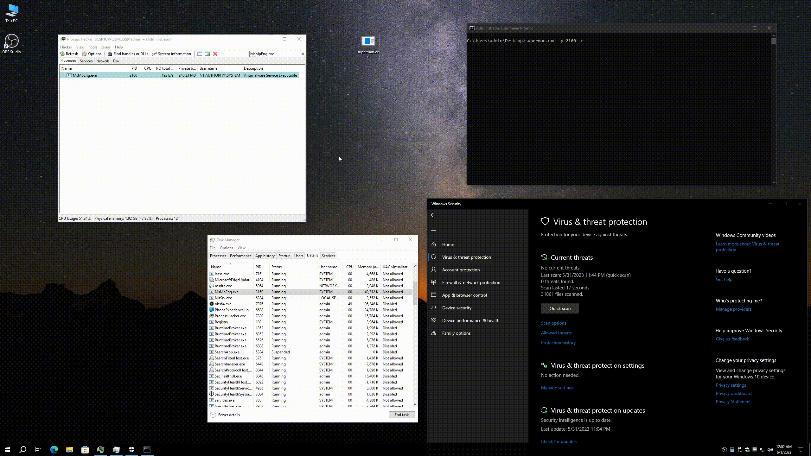

# superman

Kill The Protected Process

## usage

```shell
Options:
  -p, --pid <PID>    Pid to kill
  -r                 Recursive kill process
  -t, --time <TIME>  Kill interval time (milliseconds) [default: 500]
  -h, --help         Print help
  -V, --version      Print version
```

Kill Windows Defender (MsMpEng.exe)

```shell
superman.exe -p <PID> -r
```

